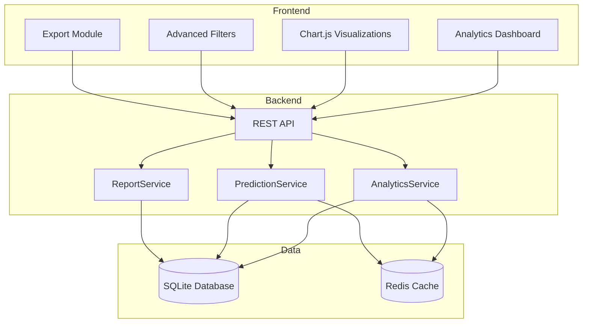
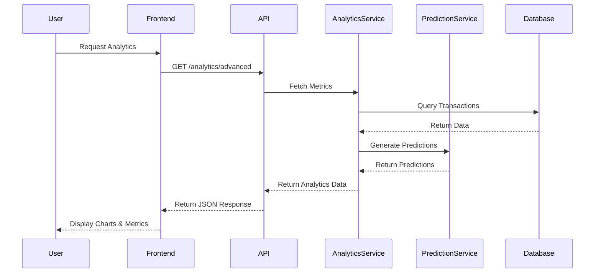

# Advanced Analytics and Reporting - Implementation Plan

## Overview
This plan outlines the implementation of advanced analytics and reporting features for the LINE Botpress Income-Expense Tracker application.

## Current State Analysis

### Existing Features
- **Monthly Summary**: Income, expense, balance for a specific month
- **Category Breakdown**: Spending by category with budget comparison
- **Monthly Trends**: 6-month income/expense trends with line chart
- **Basic Charts**: Bar chart (categories), Line chart (trends)
- **CSV Export**: Export transactions to CSV

### Technology Stack
- **Backend**: Flask 3.0.0, SQLAlchemy 2.0.23, SQLite
- **Frontend**: Chart.js 4.4.0, Lucide Icons, Custom CSS
- **Language**: Thai (primary)

---

## New Features to Implement

### 1. Enhanced Chart Types

#### 1.1 Pie/Doughnut Chart for Category Distribution
- Visual representation of expense categories
- Interactive segments with drill-down capability
- Support for both expense and income categories

#### 1.2 Stacked Bar Chart (Income vs Expense by Category)
- Side-by-side comparison of income and expense
- Monthly breakdown option
- Color-coded for easy identification

#### 1.3 Area Chart for Cumulative Savings
- Track savings over time
- Visualize net worth progression
- Highlight positive/negative periods

#### 1.4 Heatmap for Spending Patterns
- Day-of-week vs time-of-day spending heatmap
- Identify spending hotspots
- Color intensity based on amount

#### 1.5 Scatter Plot for Transaction Analysis
- Amount vs frequency scatter plot
- Identify outliers and patterns
- Category color coding

### 2. Advanced Metrics

#### 2.1 Daily Averages
- Average daily spending/income
- Weekday vs weekend comparison
- Trend analysis

#### 2.2 Spending Velocity
- Rate of spending (per day/week/month)
- Acceleration/deceleration indicators
- Forecast projections

#### 2.3 Savings Rate
- Percentage of income saved
- Month-over-month savings rate
- Target vs actual comparison

#### 2.4 Financial Health Score
- Composite score based on multiple factors
- Budget adherence (30%)
- Savings consistency (25%)
- Spending stability (25%)
- Income diversity (20%)

#### 2.5 Category Growth Rates
- Month-over-month category growth
- Year-over-year comparison
- Trend indicators (up/down/stable)

#### 2.6 Seasonal Patterns
- Identify seasonal spending trends
- Compare same period across years
- Predict seasonal fluctuations

### 3. Comparison Features

#### 3.1 Custom Date Range Comparison
- Compare any two custom date ranges
- Side-by-side metrics
- Percentage change indicators

#### 3.2 Year-over-Year Comparison
- Compare current period with same period last year
- Growth rate calculations
- Visual trend indicators

#### 3.3 Period-over-Period Comparison
- Week-over-week
- Month-over-month
- Quarter-over-quarter

### 4. Predictive Analytics

#### 4.1 Spending Forecasts
- Linear regression based on historical data
- 30/60/90 day forecasts
- Confidence intervals

#### 4.2 Budget Projections
- Predict if budget will be exceeded
- Daily spending allowance
- Remaining days calculation

#### 4.3 Savings Goal Tracking
- Track progress toward savings goals
- Time to goal estimation
- Required saving rate calculation

#### 4.4 Recurring Expense Predictions
- Identify recurring patterns
- Predict next occurrence
- Total monthly recurring expenses

#### 4.5 Income Trend Projections
- Income trend analysis
- Future income projections
- Stability assessment

### 5. Advanced Filtering and Drill-down

#### 5.1 Custom Date Range Picker
- Preset ranges (Last 7 days, Last 30 days, This month, etc.)
- Custom start/end date selection
- Quick date shortcuts

#### 5.2 Multi-Category Filtering
- Select multiple categories
- Category groups (e.g., Essentials, Discretionary)
- Save filter presets

#### 5.3 Member-Based Filtering
- Filter transactions by member
- Compare member spending
- Member contribution analysis

#### 5.4 Transaction Detail Drill-down
- Click on chart segment to see transactions
- Transaction list with filtering
- Quick edit/delete actions

#### 5.5 Export Filtered Data
- Export current view to CSV/JSON
- Include filter criteria in export
- Customizable export fields

### 6. Reporting Features

#### 6.1 Customizable Report Templates
- Pre-built templates (Monthly Report, Quarterly Review, etc.)
- Custom report builder
- Save and share templates

#### 6.2 Scheduled Reports
- Email reports on schedule
- Daily/Weekly/Monthly options
- Custom recipient lists

#### 6.3 Report Sharing
- Generate shareable links
- Password-protected reports
- Expiration dates

#### 6.4 Executive Summary
- One-page summary with key metrics
- Visual highlights
- Action items

#### 6.5 Detailed Transaction Reports
- Full transaction list
- Grouped by category/date
- Subtotals and grand totals

#### 6.6 PDF Export
- Professional PDF reports
- Include charts and tables
- Custom branding options

### 7. Data Aggregation

#### 7.1 Weekly Summaries
- Week-by-week breakdown
- Week start day configuration
- Comparison to previous week

#### 7.2 Quarterly Summaries
- Quarterly totals and averages
- Quarter-over-quarter comparison
- Annual quarter comparison

#### 7.3 Yearly Summaries
- Annual financial overview
- Year-over-year trends
- Multi-year comparison

#### 7.4 Custom Period Aggregation
- Define custom periods
- Period comparison
- Custom period reporting

---

## Architecture Design

### System Architecture



### Data Flow



---

## API Endpoints

### New Analytics Endpoints

| Endpoint | Method | Description |
|----------|--------|-------------|
| `/api/v1/projects/<id>/analytics/advanced` | GET | Get all advanced analytics data |
| `/api/v1/projects/<id>/analytics/daily-averages` | GET | Get daily average metrics |
| `/api/v1/projects/<id>/analytics/spending-velocity` | GET | Get spending velocity data |
| `/api/v1/projects/<id>/analytics/savings-rate` | GET | Get savings rate metrics |
| `/api/v1/projects/<id>/analytics/financial-health` | GET | Get financial health score |
| `/api/v1/projects/<id>/analytics/category-growth` | GET | Get category growth rates |
| `/api/v1/projects/<id>/analytics/seasonal-patterns` | GET | Get seasonal spending patterns |
| `/api/v1/projects/<id>/analytics/compare` | GET | Compare two date ranges |
| `/api/v1/projects/<id>/analytics/heatmap` | GET | Get spending heatmap data |
| `/api/v1/projects/<id>/analytics/scatter` | GET | Get scatter plot data |

### Prediction Endpoints

| Endpoint | Method | Description |
|----------|--------|-------------|
| `/api/v1/projects/<id>/predictions/forecast` | GET | Get spending forecast |
| `/api/v1/projects/<id>/predictions/budget-projection` | GET | Get budget projection |
| `/api/v1/projects/<id>/predictions/savings-goal` | GET | Get savings goal tracking |
| `/api/v1/projects/<id>/predictions/recurring` | GET | Get recurring expense predictions |
| `/api/v1/projects/<id>/predictions/income-trend` | GET | Get income trend projections |

### Reporting Endpoints

| Endpoint | Method | Description |
|----------|--------|-------------|
| `/api/v1/projects/<id>/reports/templates` | GET | List report templates |
| `/api/v1/projects/<id>/reports/generate` | POST | Generate custom report |
| `/api/v1/projects/<id>/reports/schedule` | POST | Schedule report |
| `/api/v1/projects/<id>/reports/<id>` | GET | Get specific report |
| `/api/v1/projects/<id>/reports/<id>/pdf` | GET | Export report as PDF |
| `/api/v1/projects/<id>/reports/<id>/share` | POST | Generate share link |

### Aggregation Endpoints

| Endpoint | Method | Description |
|----------|--------|-------------|
| `/api/v1/projects/<id>/aggregations/weekly` | GET | Get weekly summaries |
| `/api/v1/projects/<id>/aggregations/quarterly` | GET | Get quarterly summaries |
| `/api/v1/projects/<id>/aggregations/yearly` | GET | Get yearly summaries |
| `/api/v1/projects/<id>/aggregations/custom` | POST | Get custom period aggregation |

---

## Database Schema Changes

### New Tables

#### `analytics_cache`
```sql
CREATE TABLE analytics_cache (
    id TEXT PRIMARY KEY,
    project_id TEXT NOT NULL,
    cache_key TEXT NOT NULL,
    cache_data TEXT NOT NULL,
    created_at TIMESTAMP DEFAULT CURRENT_TIMESTAMP,
    expires_at TIMESTAMP NOT NULL,
    FOREIGN KEY (project_id) REFERENCES project(id)
);
```

#### `report_templates`
```sql
CREATE TABLE report_templates (
    id TEXT PRIMARY KEY,
    project_id TEXT NOT NULL,
    name TEXT NOT NULL,
    description TEXT,
    config TEXT NOT NULL,  -- JSON configuration
    created_by TEXT NOT NULL,
    created_at TIMESTAMP DEFAULT CURRENT_TIMESTAMP,
    updated_at TIMESTAMP DEFAULT CURRENT_TIMESTAMP,
    FOREIGN KEY (project_id) REFERENCES project(id),
    FOREIGN KEY (created_by) REFERENCES user(id)
);
```

#### `scheduled_reports`
```sql
CREATE TABLE scheduled_reports (
    id TEXT PRIMARY KEY,
    project_id TEXT NOT NULL,
    template_id TEXT,
    name TEXT NOT NULL,
    schedule_type TEXT NOT NULL,  -- daily, weekly, monthly
    schedule_config TEXT,  -- JSON config (day_of_week, day_of_month, etc.)
    recipients TEXT,  -- JSON array of email addresses
    last_run_at TIMESTAMP,
    next_run_at TIMESTAMP,
    is_active BOOLEAN DEFAULT TRUE,
    created_at TIMESTAMP DEFAULT CURRENT_TIMESTAMP,
    FOREIGN KEY (project_id) REFERENCES project(id),
    FOREIGN KEY (template_id) REFERENCES report_templates(id)
);
```

#### `share_links`
```sql
CREATE TABLE share_links (
    id TEXT PRIMARY KEY,
    project_id TEXT NOT NULL,
    report_id TEXT,
    token TEXT UNIQUE NOT NULL,
    created_by TEXT NOT NULL,
    expires_at TIMESTAMP,
    password_hash TEXT,
    created_at TIMESTAMP DEFAULT CURRENT_TIMESTAMP,
    FOREIGN KEY (project_id) REFERENCES project(id),
    FOREIGN KEY (created_by) REFERENCES user(id)
);
```

#### `savings_goals`
```sql
CREATE TABLE savings_goals (
    id TEXT PRIMARY KEY,
    project_id TEXT NOT NULL,
    name TEXT NOT NULL,
    target_amount INTEGER NOT NULL,  -- satang
    current_amount INTEGER DEFAULT 0,  -- satang
    target_date DATE,
    category_id TEXT,
    is_active BOOLEAN DEFAULT TRUE,
    created_at TIMESTAMP DEFAULT CURRENT_TIMESTAMP,
    updated_at TIMESTAMP DEFAULT CURRENT_TIMESTAMP,
    FOREIGN KEY (project_id) REFERENCES project(id),
    FOREIGN KEY (category_id) REFERENCES category(id)
);
```

---

## Frontend Components

### New Pages

1. **`app/templates/analytics_advanced.html`**
   - Advanced analytics dashboard
   - Multiple chart types
   - Interactive filters

2. **`app/templates/reports.html`**
   - Report templates list
   - Custom report builder
   - Scheduled reports management

3. **`app/templates/report_view.html`**
   - Report display
   - Print/Export options
   - Share functionality

### New JavaScript Modules

1. **`app/static/js/analytics_advanced.js`**
   - Advanced chart rendering
   - Data aggregation
   - Interactive filters

2. **`app/static/js/predictions.js`**
   - Forecast visualizations
   - Prediction calculations
   - Trend indicators

3. **`app/static/js/reports.js`**
   - Report generation
   - Template management
   - Export functionality

4. **`app/static/js/charts.js`**
   - Chart.js wrapper
   - Chart configurations
   - Chart interactions

### New CSS Styles

- Chart container styles
- Filter panel styles
- Report layout styles
- Print styles for reports

---

## Implementation Phases

### Phase 1: Enhanced Charts (Foundation)
- Pie/Doughnut chart
- Stacked bar chart
- Area chart
- Chart.js integration enhancements

### Phase 2: Advanced Metrics
- Daily averages
- Spending velocity
- Savings rate
- Financial health score

### Phase 3: Predictive Analytics
- Spending forecasts
- Budget projections
- Savings goal tracking

### Phase 4: Advanced Filtering
- Custom date range picker
- Multi-category filtering
- Member-based filtering
- Drill-down functionality

### Phase 5: Reporting System
- Report templates
- Custom report builder
- PDF export
- Report sharing

### Phase 6: Data Aggregation
- Weekly summaries
- Quarterly summaries
- Yearly summaries
- Custom periods

---

## File Structure

```
app/
├── services/
│   ├── analytics_service.py (enhance)
│   ├── prediction_service.py (new)
│   ├── report_service.py (new)
│   └── aggregation_service.py (new)
├── models/
│   ├── analytics_cache.py (new)
│   ├── report_template.py (new)
│   ├── scheduled_report.py (new)
│   ├── share_link.py (new)
│   └── savings_goal.py (new)
├── routes/
│   └── api.py (add new endpoints)
├── templates/
│   ├── analytics_advanced.html (new)
│   ├── reports.html (new)
│   └── report_view.html (new)
├── static/
│   ├── js/
│   │   ├── analytics_advanced.js (new)
│   │   ├── predictions.js (new)
│   │   ├── reports.js (new)
│   │   └── charts.js (new)
│   └── css/
│       └── analytics.css (new)
└── utils/
    ├── prediction_helpers.py (new)
    └── report_helpers.py (new)
```

---

## Dependencies

### New Python Dependencies
```txt
# Data Analysis
pandas==2.1.4
numpy==1.26.2
scipy==1.11.4

# Machine Learning (for predictions)
scikit-learn==1.3.2

# PDF Generation
reportlab==4.0.7
weasyprint==60.2

# Caching
redis==5.0.1
```

### New Frontend Dependencies
- Chart.js 4.4.0 (already included)
- Chart.js plugins:
  - chartjs-plugin-datalabels
  - chartjs-plugin-zoom
  - date-fns for date handling

---

## Performance Considerations

1. **Caching Strategy**
   - Cache expensive analytics queries
   - Use Redis for distributed caching
   - Cache expiration based on data freshness

2. **Query Optimization**
   - Add database indexes for frequently queried fields
   - Use aggregation functions at database level
   - Pagination for large datasets

3. **Lazy Loading**
   - Load charts on demand
   - Progressive data loading
   - Skeleton screens for better UX

4. **Background Jobs**
   - Scheduled reports run in background
   - Prediction calculations can be async
   - Cache warming for popular queries

---

## Security Considerations

1. **Authentication**
   - All analytics endpoints require authentication
   - Project membership verification
   - Role-based access control

2. **Data Privacy**
   - Share links with optional password protection
   - Expiration dates for shared reports
   - No sensitive data in URLs

3. **Rate Limiting**
   - Limit API calls per user
   - Prevent abuse of expensive queries
   - Throttle report generation

---

## Testing Strategy

1. **Unit Tests**
   - Test analytics service methods
   - Test prediction algorithms
   - Test report generation

2. **Integration Tests**
   - Test API endpoints
   - Test database queries
   - Test chart rendering

3. **End-to-End Tests**
   - Test complete user workflows
   - Test report generation and export
   - Test sharing functionality

---

## Success Metrics

1. **Performance**
   - Analytics page load time < 2 seconds
   - Chart rendering < 500ms
   - Report generation < 5 seconds

2. **Usage**
   - Increased time spent on analytics page
   - More frequent report exports
   - Higher user engagement

3. **Accuracy**
   - Prediction accuracy > 80%
   - Financial health score correlates with user feedback
   - Reports match transaction data exactly

---

## Future Enhancements

1. **AI-Powered Insights**
   - Natural language queries
   - Anomaly detection
   - Personalized recommendations

2. **Multi-Currency Support**
   - Exchange rate integration
   - Currency conversion
   - Multi-currency reports

3. **Advanced Visualizations**
   - 3D charts
   - Sankey diagrams
   - Network graphs

4. **Integration Features**
   - Bank account synchronization
   - Credit card integration
   - Investment tracking
